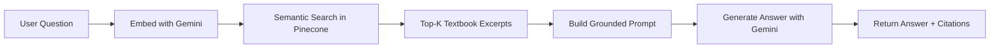

<p align="center">
  
  
  
  
  
</p>

# 📚 BookHelp — AI-Powered Textbook Tutor

**BookHelp** is a full-stack AI study assistant that lets students ask questions from their textbooks and receive answers grounded directly in book excerpts. It uses Retrieval-Augmented Generation (RAG) to embed textbook PDFs into a vector database and retrieves relevant context before generating answers — so every response comes with page-level citations.

Built for **Maharashtra State Board** students (currently Class 9), but designed to scale to any board, standard, or subject.

---

## ✨ Features

| Feature | Description |
|---|---|
| **RAG-Powered Q&A** | Questions are answered using actual textbook content, not generic AI knowledge |
| **Textbook Citations** | Every answer includes source excerpts with chapter name, page number, and relevance score |
| **Embedded PDF Reader** | Read the textbook PDF side-by-side with the AI chat in a resizable split-pane layout |
| **Conversation History** | Follow-up questions maintain context from previous messages in the session |
| **Multi-Subject Library** | Dashboard shows all subjects available for the student's class standard |
| **JWT Authentication** | Secure register/login flow with standard-aware user profiles |
| **Mobile-Responsive** | Tabbed chat/textbook layout on mobile, split-pane on desktop |
| **PDF Vectorization Pipeline** | Standalone scripts to chunk, embed, and upsert textbook PDFs into Pinecone with rate limiting and resume support |

---

## 🏗️ Architecture

```
┌─────────────────────────────────────────────────────────────┐
│                        Frontend (React + Vite)              │
│   HomePage ──── AuthPage ──── BookPage (PDF + Chat)         │
│       │              │              │                       │
│       └──── bookApi.js / authApi.js (fetch layer) ──────────┤
│                        Vite Proxy (/ask, /books, /auth)     │
└────────────────────────────┬────────────────────────────────┘
                             │
                             ▼
┌─────────────────────────────────────────────────────────────┐
│                    Backend (Express 5 + Node.js)            │
│                                                             │
│   Routes:  /auth   → register, login (JWT)                  │
│            /books  → subjects by standard (protected)       │
│            /ask    → RAG question answering                 │
│            /health → health check                           │
│                                                             │
│   Ask Flow:                                                 │
│   1. Embed user query → Gemini Embedding API                │
│   2. Semantic search  → Pinecone vector DB                  │
│   3. Build context    → top-K textbook excerpts             │
│   4. Generate answer  → Gemini Chat API (grounded prompt)   │
│   5. Return answer + source citations                       │
│                                                             │
│   Data:  MySQL (users, books) │ Pinecone (vector embeddings)│
└─────────────────────────────────────────────────────────────┘
```

---

## 📁 Project Structure

```
BookHelp/
├── frontend/                    # React 19 + Vite 8 SPA
│   ├── src/
│   │   ├── components/
│   │   │   └── DashboardShell.jsx   # Sidebar + topbar layout
│   │   ├── pages/
│   │   │   ├── HomePage.jsx         # Landing page & subject dashboard
│   │   │   ├── AuthPage.jsx         # Login / Register forms
│   │   │   └── BookPage.jsx         # PDF reader + AI chat split-pane
│   │   ├── lib/
│   │   │   ├── authApi.js           # Auth fetch helpers & JWT storage
│   │   │   └── bookApi.js           # Subject & ask-question API calls
│   │   ├── App.jsx                  # Router & auth state management
│   │   ├── App.css                  # Full design system
│   │   └── index.css                # CSS reset & base tokens
│   ├── vite.config.js               # Dev proxy → backend
│   └── .env                         # VITE_BACKEND_URL
│
├── backend/                     # Express 5 + Node.js API
│   ├── src/
│   │   ├── config/
│   │   │   └── db.js                # MySQL2 connection pool
│   │   ├── controllers/
│   │   │   ├── authController.js    # Register & login with bcrypt + JWT
│   │   │   └── bookController.js    # Get subjects by student standard
│   │   ├── middleware/
│   │   │   ├── authMiddleware.js     # JWT verification (protect)
│   │   │   ├── asyncHandler.js       # Async error wrapper
│   │   │   └── errorMiddleware.js    # 404 + global error handler
│   │   ├── models/
│   │   │   ├── userModel.js         # users table queries
│   │   │   └── bookModel.js         # books table queries
│   │   ├── routes/
│   │   │   ├── authRoutes.js        # POST /auth/register, /auth/login
│   │   │   ├── bookRoutes.js        # GET  /books/subjects (protected)
│   │   │   └── askRoutes.js         # POST /ask
│   │   ├── services/
│   │   │   └── askService.js        # Full RAG pipeline (embed → search → generate)
│   │   ├── app.js                   # Express app setup & middleware
│   │   └── index.js                 # Server entry point
│   ├── vectorizing_pdfs/            # Offline PDF → Pinecone ingestion scripts
│   │   ├── geo.js                   # Geography textbook vectorizer
│   │   ├── sci.js                   # Science textbook vectorizer
│   │   └── hc.js                    # History/Civics textbook vectorizer
│   └── .env                         # API keys, DB config, secrets
│
├── .gitignore
├── LICENSE                      # Apache 2.0
└── README.md
```

---

## 🚀 Getting Started

### Prerequisites

- **Node.js** ≥ 18
- **MySQL** 5.7+ or 8.x
- **Pinecone** account (free tier works)
- **Google AI** API key (Gemini embedding + chat models)

### 1. Clone the repository

```bash
git clone https://github.com/AshikAHegde/BookHelp.git
cd BookHelp
```

### 2. Set up the database

Create a MySQL database and the required tables:

```sql
CREATE DATABASE IF NOT EXISTS bookhelp;
USE bookhelp;

CREATE TABLE users (
  id         INT AUTO_INCREMENT PRIMARY KEY,
  name       VARCHAR(255) NOT NULL,
  email      VARCHAR(255) NOT NULL UNIQUE,
  password   VARCHAR(255) NOT NULL,
  standard   INT NOT NULL,
  created_at TIMESTAMP DEFAULT CURRENT_TIMESTAMP
);

CREATE TABLE books (
  id        INT AUTO_INCREMENT PRIMARY KEY,
  subject   VARCHAR(255) NOT NULL,
  pdf_url   TEXT,
  standard  INT NOT NULL
);

-- Example: add subjects for Class 9
INSERT INTO books (subject, pdf_url, standard) VALUES
  ('Science and Technology', 'https://example.com/science-9.pdf', 9),
  ('Geography', 'https://example.com/geography-9.pdf', 9),
  ('History and Civics', 'https://example.com/history-9.pdf', 9);
```

### 3. Configure the backend

```bash
cd backend
npm install
```

Create `backend/.env`:

```env
PORT=5000
NODE_ENV=development

# MySQL
DB_HOST=localhost
DB_PORT=3306
DB_USER=your_db_user
DB_PASSWORD=your_db_password
DB_NAME=bookhelp

# Auth
JWT_SECRET=your_super_secret_jwt_key
JWT_EXPIRES_IN=7d

# Pinecone (vector database)
PINECONE_API_KEY=your_pinecone_api_key
PINECONE_ENVIRONMENT=us-east-1
PINECONE_INDEX_NAME=bookhelp

# Google Gemini AI
GEMINI_API_KEY=your_gemini_api_key
GROQ_API_KEY=your_groq_api_key          # Optional fallback
```

### 4. Configure the frontend

```bash
cd ../frontend
npm install
```

Create `frontend/.env`:

```env
VITE_BACKEND_URL=http://localhost:5000
```

### 5. Vectorize textbooks (one-time)

Place your textbook PDFs in `backend/vectorizing_pdfs/` and run the appropriate script:

```bash
cd ../backend

# Science textbook
node vectorizing_pdfs/sci.js

# Geography textbook
node vectorizing_pdfs/geo.js
```

> Each script supports **automatic resume** — if it gets rate-limited or interrupted, just re-run and it picks up from the last completed batch.

### 6. Start development servers

**Terminal 1 — Backend:**
```bash
cd backend
npm run dev          # Starts Express on port 5000 with nodemon
```

**Terminal 2 — Frontend:**
```bash
cd frontend
npm run dev          # Starts Vite on port 5173 with proxy to backend
```

Open **http://localhost:5173** in your browser.

---

## 🔌 API Reference

### Auth

| Method | Endpoint | Body | Description |
|--------|----------|------|-------------|
| `POST` | `/auth/register` | `{ name, email, password, standard }` | Create account |
| `POST` | `/auth/login` | `{ email, password }` | Get JWT token |

### Books (requires Bearer token)

| Method | Endpoint | Description |
|--------|----------|-------------|
| `GET` | `/books/subjects` | List subjects for the user's standard |

### Ask (RAG)

| Method | Endpoint | Body | Description |
|--------|----------|------|-------------|
| `POST` | `/ask` | `{ query, history?, standard?, subject?, topK? }` | Ask a textbook question |

**Response:**
```json
{
  "success": true,
  "queryText": "What is Newton's first law?",
  "answer": "Newton's first law states that...",
  "sources": [
    {
      "score": 0.89,
      "chapter": "Laws of Motion",
      "page": 3,
      "text": "An object at rest stays at rest..."
    }
  ]
}
```

### Health

| Method | Endpoint | Description |
|--------|----------|-------------|
| `GET` | `/health` | Server health check |

---

## 🧠 How the RAG Pipeline Works



1. **Embed** — The user's question is converted to a 1024-dim vector using `gemini-embedding-001`
2. **Search** — The vector is queried against Pinecone with optional filters (standard, subject)
3. **Context** — Top-K matching textbook excerpts are assembled into a prompt
4. **Generate** — Gemini (`gemini-3.5-flash`) generates an answer constrained to the retrieved context
5. **Cite** — Source excerpts (chapter, page, relevance score) are returned alongside the answer

---

## 🛠️ Tech Stack

| Layer | Technology |
|-------|------------|
| **Frontend** | React 19, Vite 8, Framer Motion, Lucide Icons, React Router 7 |
| **Backend** | Node.js, Express 5, MySQL2, bcrypt, JWT |
| **AI/ML** | Google Gemini (embedding + generation), Pinecone (vector DB) |
| **PDF Processing** | LangChain (PDF loader + text splitter) |
| **Dev Tools** | Nodemon, OxLint, Vite HMR |

---

## 📄 License

This project is licensed under the **Apache License 2.0** — see the [LICENSE](LICENSE) file for details.
